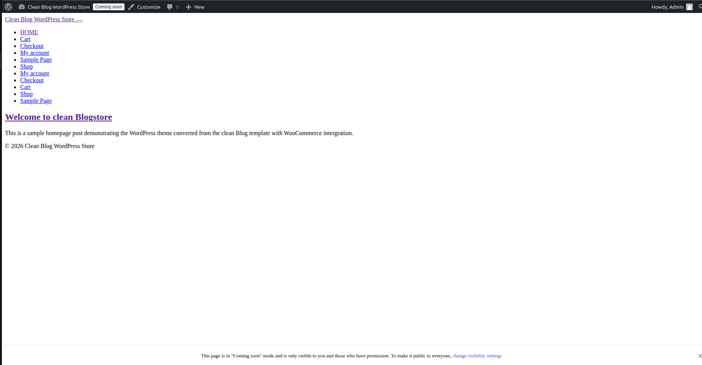
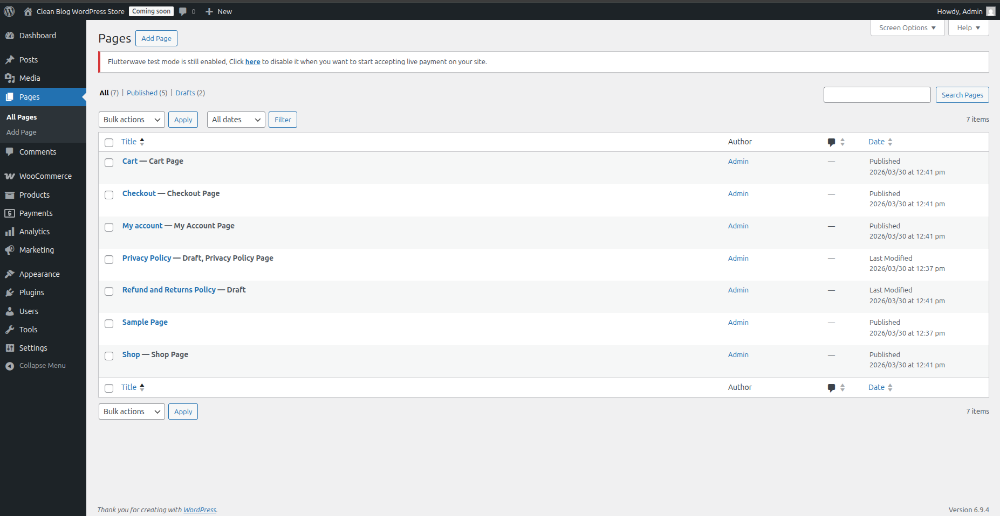
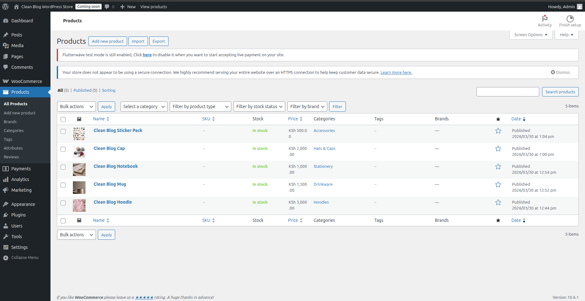
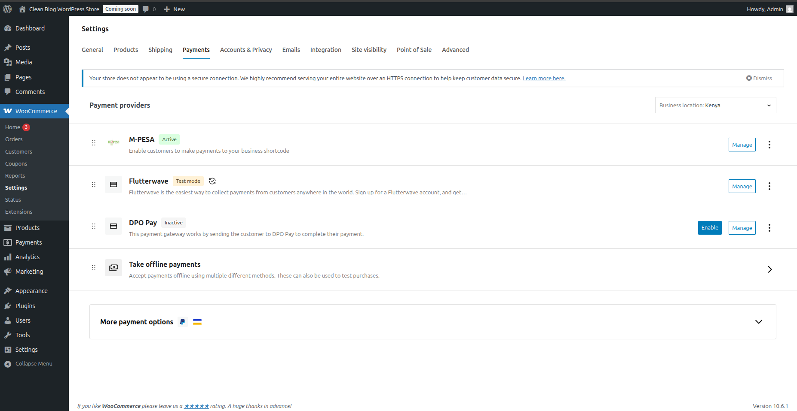

# Clean Blog WordPress E-commerce Theme

## Project Overview

This project demonstrates the conversion of a static HTML template into a functional WordPress theme and the integration of WooCommerce to support e-commerce functionality.


---

# Technologies Used

* WordPress
* WooCommerce
* PHP
* MySQL
* HTML / CSS
* JavaScript
* XAMPP (Apache, MySQL, PHP)
* Git & GitHub

---

# Template Source

The design used in this project is based on the Clean Blog template.

Original template:

https://startbootstrap.com/previews/clean-blog-jekyll

The template was converted into a WordPress theme structure.

---
```bash
# Project Structure
wordpress-clean-blog-ecommerce/
├── clean-blog-theme/
│   ├── assets/
│   │   ├── main.scss
│   │   ├── scripts.js
│   │   └── vendor/
│   │       ├── bootstrap/           
│   │       └── startbootstrap-clean-blog/  
│   ├── img/
│   │   ├── bg-about.jpg
│   │   ├── bg-contact.jpg
│   │   ├── bg-index.jpg
│   │   ├── bg-post.jpg
│   │   └── posts/                   
│   │       
│   │       
│   │       
│   │       
│   │      
│   │       
│   ├── archive.php                  
│   ├── footer.php                   
│   ├── functions.php                
│   ├── header.php                   
│   ├── index.php                    
│   ├── page.php                     
│   ├── single.php                   
│   ├── style.css                    
│   └── screenshot.png               
├── screenshots/                    
│   ├── frontend-homepage.png
│   ├── pages.png
│   ├── payment-gateways.png
│   └── products.png
└── README.md                       
```

---

# Screenshots

## Frontend Homepage


## Pages


## Products


## Payment Gateways


---

# WooCommerce Setup

WooCommerce was installed through the WordPress plugin system.

It automatically generated the following pages:

* Shop
* Cart
* Checkout
* My Account

Sample products were added to simulate an e-commerce store.

---

# Payment Gateway Integration

The following payment gateways were installed and configured:

## M-Pesa

Plugin: M-Pesa Checkout for WooCommerce

Configuration requires:

* Consumer Key
* Consumer Secret
* Shortcode
* Passkey

## Flutterwave

Plugin: Flutterwave WooCommerce Payment Gateway

Configuration requires:

* Public Key
* Secret Key
* Encryption Key

## DPO

Plugin: DPO Pay WooCommerce Plugin

Required fields:

* Company Token
* Default DPO Service Type
* Add Order Meta to Company Address
* Add Order Meta to Service

## Pesapal

Pesapal integration was researched but the plugin was not available in the WordPress plugin repository. Integration normally requires manual installation from the Pesapal developer portal.

---

# Local Development Setup

1. Install XAMPP / LAMPP
2. Place WordPress inside:

/opt/lampp/htdocs/

3. Create a database using phpMyAdmin
4. Run WordPress installation
5. Activate the Clean Blog theme
6. Install WooCommerce and payment gateways

---

# Author

Emma
